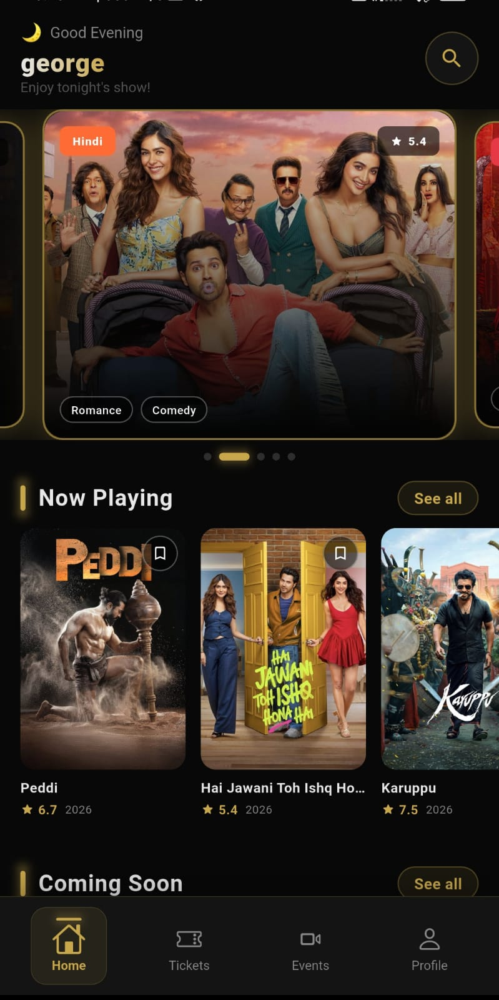
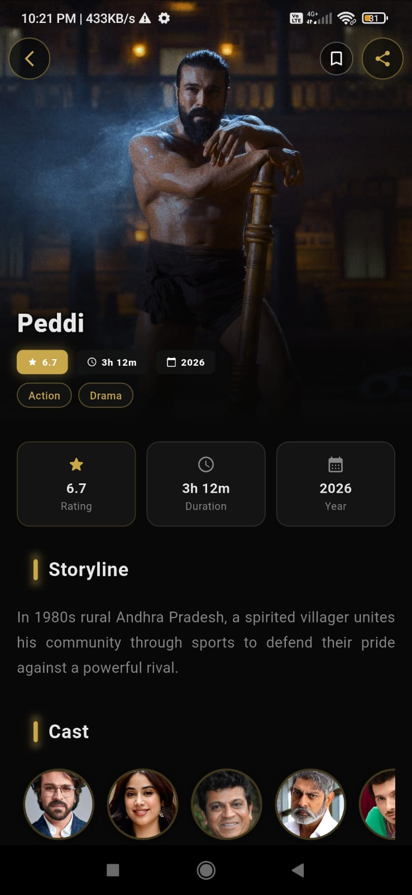
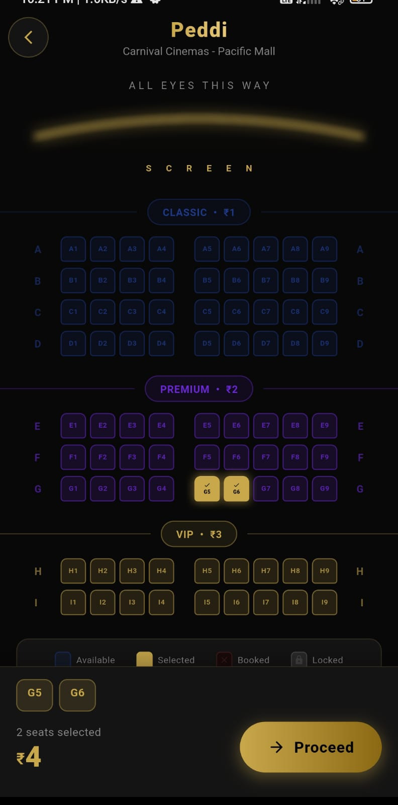
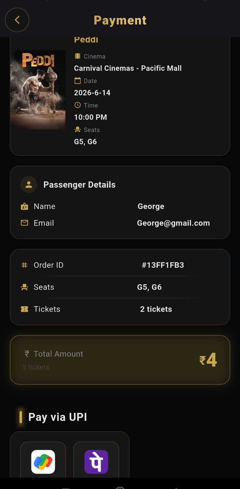
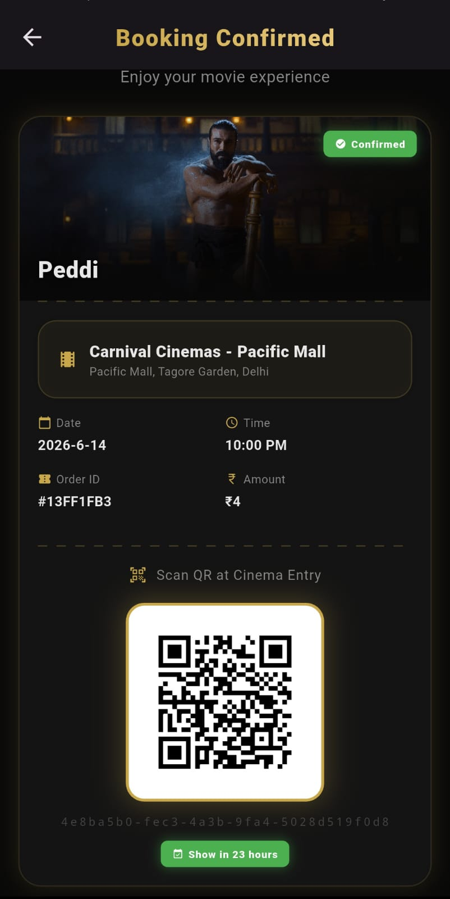
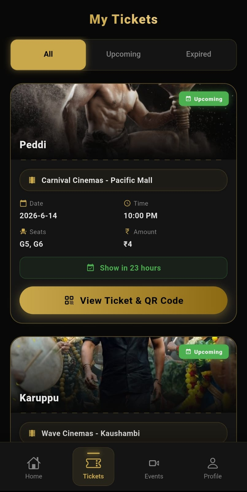

# FlixPoint

A full-stack Android movie ticket booking app built with Flutter and Firebase — real-time seat locking, UPI payments, QR tickets, and offline support in one production-style mobile experience.

---

## Table of Contents
- [About](#about)
- [Screenshots](#screenshots)
- [Features](#features)
- [Tech Stack](#tech-stack)
- [Project Structure](#project-structure)
- [Getting Started](#getting-started)

- [Architecture & Key Decisions](#architecture--key-decisions)
- [Developer](#developer)
- [License](#license)

---

## About
FlixPoint is an Android movie ticket booking app built with Flutter for discovery, seat selection, and digital ticket delivery in one flow. It combines Firebase, Hive, and TMDB to support real-time booking, offline access, and movie browsing with live data. The app uses a dark glassmorphism UI, structured animations, and a booking workflow designed for production-style mobile experiences.

---


---

## Screenshots

<table>
  <tr>
    <td align="center"><b>Home</b></td>
    <td align="center"><b>Movie Details</b></td>
    <td align="center"><b>Seat Selection</b></td>
  </tr>
  <tr>
    <td></td>
    <td></td>
    <td></td>
  </tr>
  <tr>
    <td align="center"><b>Payment</b></td>
    <td align="center"><b>Ticket </b></td>
    <td align="center"><b>Booking History</b></td>
  </tr>
  <tr>
    <td></td>
    <td></td>
    <td></td>
  </tr>
</table>

---

## Features

### Discovery
- Browse Now Playing, Upcoming, Popular, and Trending movies
- Explore Hindi, Tamil, and Telugu regional movie sections
- Smart search with debounce and search history
- Movie news with category-based feeds
- Movie details with cast, trailers, and similar titles

### Booking Flow
- Cinema selection with real-time seat availability
- Interactive seat map with live seat-locking
- Passenger details capture before payment
- UPI payment flow for GPay and PhonePe
- Double booking prevention via Firestore transactions

### Post-Booking
- Digital ticket with QR code
- PDF ticket generation and sharing
- Booking history with upcoming, today, and expired status tracking
- Watchlist with offline Hive storage

### UX
- Offline mode with cached data
- Responsive layout for phones and tablets
- Lottie animations for success states
- Dark glassmorphism design system with gold/amber accents

---

## Tech Stack

| Technology | Purpose |
|---|---|
| Flutter 3.x + Dart | UI framework and application logic |
| Firebase Authentication | Email/password sign-in |
| Firebase Firestore | Real-time database for cinemas, seats, and bookings |
| Hive | Local storage for offline watchlist and cached data |
| Provider | State management |
| TMDB API | Movie discovery, search, and metadata |
| GNews API | Movie news feed |
| cached_network_image | Image caching |
| flutter_animate | UI animations |
| upi_pay | UPI payment integration |
| pdf | PDF ticket generation |
| share_plus | Native share sheet |
| qr_flutter | QR code generation |
| lottie | Success animations |
| flutter_dotenv | Environment variable management |
| uuid | Booking ID generation |

---

## Project Structure

```text
lib/
├── auth/          # Sign in, sign up
├── methods/       # Firebase auth, Firestore, storage
├── models/        # Data models
├── provider/      # State management
├── screens/       # 11 screens
├── services/      # API and local services
├── utils/         # Colors, constants, helpers, extensions
└── widgets/
    ├── common/    # 15 shared widgets
    ├── cinema/    # Cinema widgets
    ├── movie/     # Movie widgets
    └── ticket/    # Ticket widgets
```

---

## Getting Started

### Prerequisites
- Flutter 3.x SDK
- Android Studio or VS Code
- Firebase project with Authentication and Firestore enabled
- TMDB API key
- GNews API key

### Setup

```bash
git clone <https://github.com/originehsan/FlixPoint.git>
cd flixpoint
flutter pub get
```

Create a `.env` file in the project root:

```env
TMDB_API_KEY=your_tmdb_key
GNEWS_API_KEY=your_gnews_key
```

Add `google-services.json` to `android/app/` from your Firebase console.

```bash
flutter run
```


## Architecture & Key Decisions

FlixPoint uses Firestore transactions to lock seats in real time, preventing double booking when multiple users target the same show. Hive provides an offline-first layer for watchlist and cached data so the app remains usable when network quality drops. TMDB powers all movie discovery and search, while GNews feeds the news section. The UPI flow integrates GPay and PhonePe, then hands off to ticket generation with QR code and PDF output after payment confirmation.

The UI follows a dark glassmorphism system built around a deep navy base with gold accents. Provider manages state across booking, cinema, movie, and user flows with clear separation between data and UI layers.

---

## Developer

Built by **Ehsan Ali** 

- LinkedIn: www.linkedin.com/in/ehsan-7x
- GitHub: https://github.com/originehsan

---

## License

MIT License — Copyright (c) 2026 Ehsan

See [LICENSE](LICENSE) for full text.
